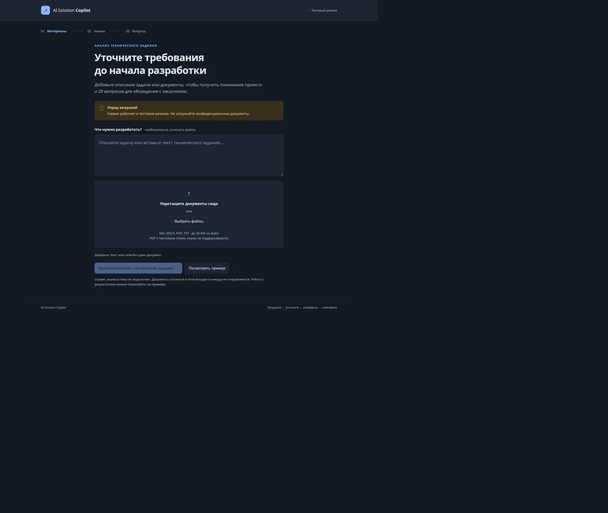
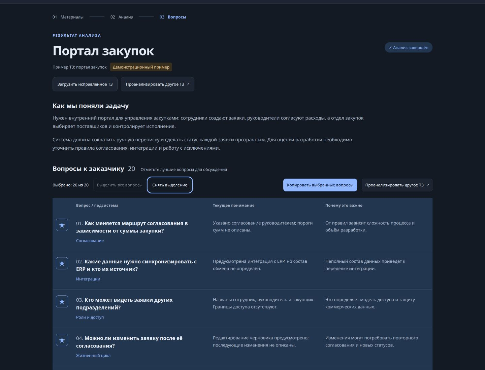
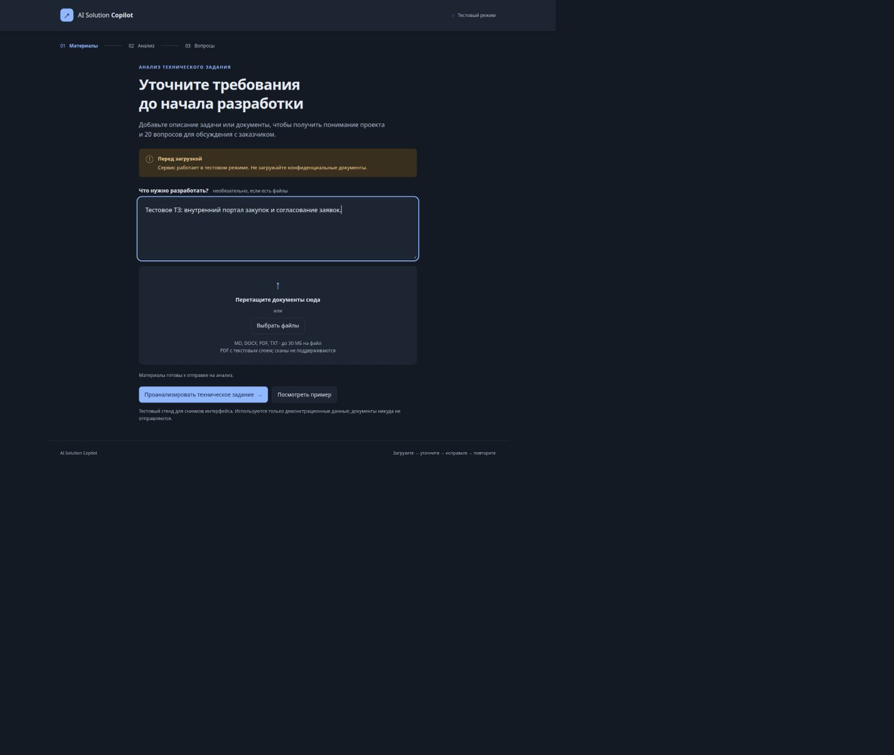
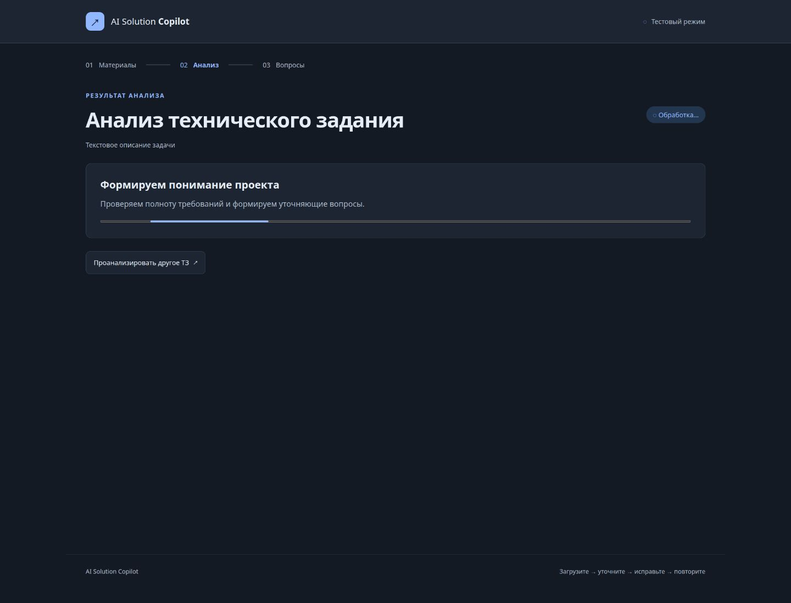
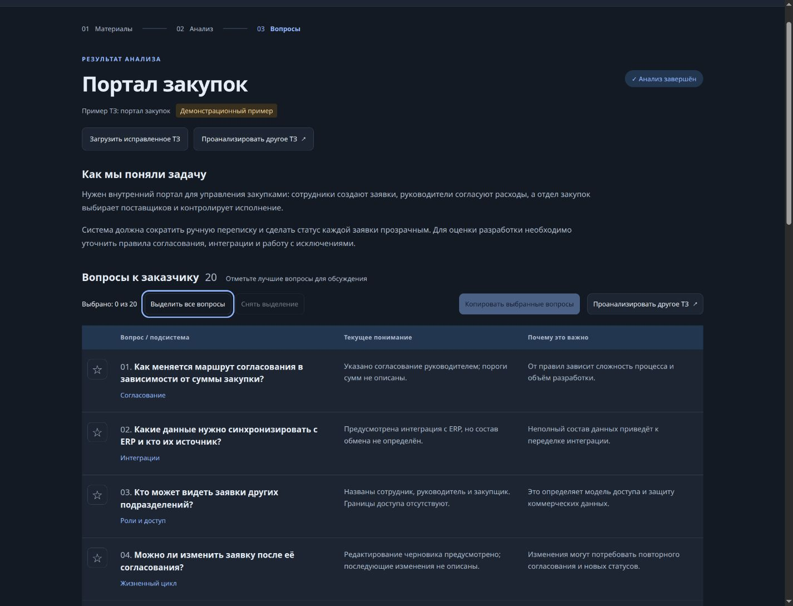
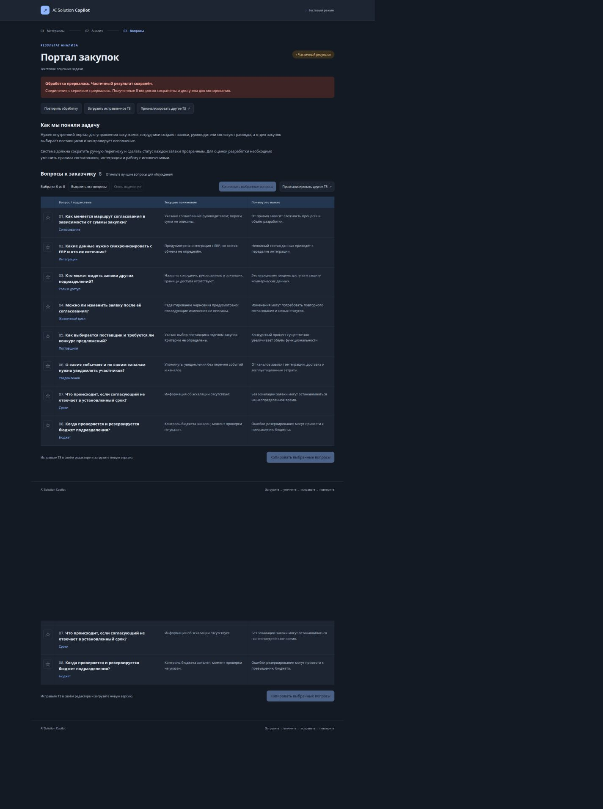
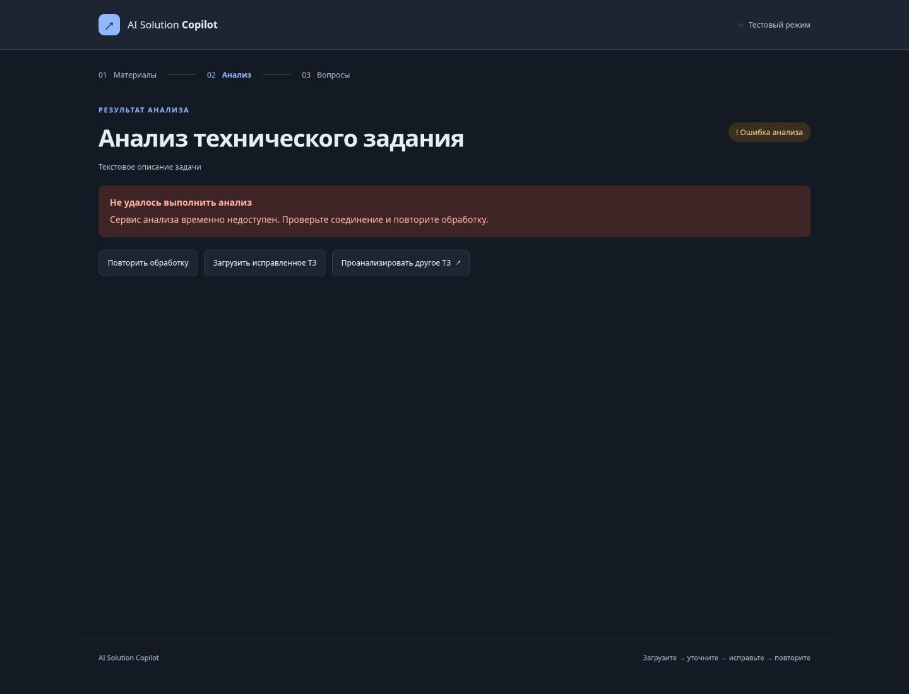
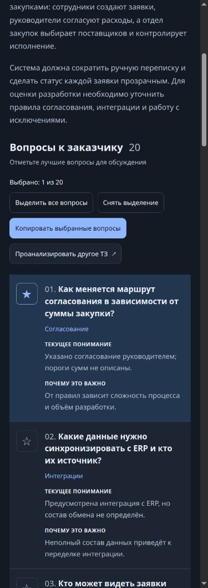

# Вариант 3 — табличный интерфейс

Табличный интерфейс AI Solution Copilot. PNG сняты с реализованного интерфейса `web/dist/` 28 сентября 2026 года, в тёмной теме браузера, на демонстрационных данных. Это снимки реализации макета, а не сгенерированная AI-картинка.

Снимки можно открыть непосредственно на GitHub или в локальном просмотрщике изображений. Запуск приложения для просмотра не нужен.

## Загрузка материалов

Desktop, ширина окна 1440 CSS px.



## Результаты и выделение всех вопросов

Desktop, окно 1440 × 1100 CSS px. В списке 20 вопросов; снимок показывает верхнюю часть страницы. Все вопросы доступны в полной версии ниже.



[Полная страница со всеми вопросами](images/variant-3-results-full.png).

## Готовность к анализу

Форма с заполненным описанием и доступной кнопкой запуска.



## Обработка

Индикатор выполнения, заблокированное повторное выполнение и возможность открыть другое ТЗ.



## Результат без выделения

Копирование недоступно, пока не выбран хотя бы один вопрос.



## Частичный результат

Обработка прервалась; восемь полученных вопросов сохранены. Доступны выбор, копирование и повторная обработка.



## Ошибка

Понятная причина сбоя, повторная обработка и загрузка исправленного ТЗ.



## Мобильный вид

Mobile, окно 390 × 1100 CSS px. На узком экране строки таблицы складываются в вертикальные блоки.



## Интерактивный исходник

[copilot-mockups.html](copilot-mockups.html) — сохранённый исходный прототип с тремя компоновками; по умолчанию открывается третья. Файл является HTML-фрагментом среды макетов, а не самостоятельным приложением. GitHub показывает его исходный текст; для просмотра без запуска используйте PNG выше.

## Обновление снимков

1. Запустить приложение по инструкции в [web/README.md](../../web/README.md).
2. Открыть пустую форму при ширине 1440 px и снять полную страницу в `variant-3-upload-desktop.png`.
3. Нажать «Посмотреть пример», дождаться завершения, затем «Выделить все вопросы». Вернуться к началу страницы. Снять окно 1440 × 1100 в `variant-3-results-desktop.png` и полную страницу в `variant-3-results-full.png`.
4. Установить окно 390 × 1100, показать начало блока вопросов и снять `variant-3-results-mobile.png`.
5. Проверить читаемость, обновить дату и включить PNG в тот же PR, что и изменения дизайна. Использовать только демонстрационные данные.

Стабильные имена файлов позволяют README всегда показывать актуальную версию. История вариантов остаётся в Git; папки с датированными дублями не нужны. Снимки не коммитятся автоматически из CI.

### Воспроизвести обработку, частичный результат и ошибку

В приложении один URL с разными состояниями. Для воспроизводимых снимков состояний, которые требуют ответа сервиса, предусмотрен **локальный тестовый стенд**:

```sh
cd web
node tests/preview-states.mjs
```

Откройте `http://127.0.0.1:4174/?scenario=processing`, введите тестовое описание и нажмите «Проанализировать техническое задание». Обработка будет оставаться активной до перезагрузки вкладки. Для частичного результата используйте `?scenario=partial`, для ошибки — `?scenario=error`, для успешного результата — `?scenario=complete`. Перед запуском анализа можно снять состояние готовности.

Стенд отдаёт те же HTML, CSS и JavaScript приложения, заменяя только неподключённый адаптер анализа тестовым. Сценарий частичного результата передаёт 8 вопросов, затем имитирует обрыв соединения. Этот сервер и его тестовые ответы находятся в `web/tests/` и **не входят в артефакт `web/dist/`**. Снимки `ready`, `processing`, `partial` и `error` сделаны на этом стенде; остальные — на обычном локальном приложении.
